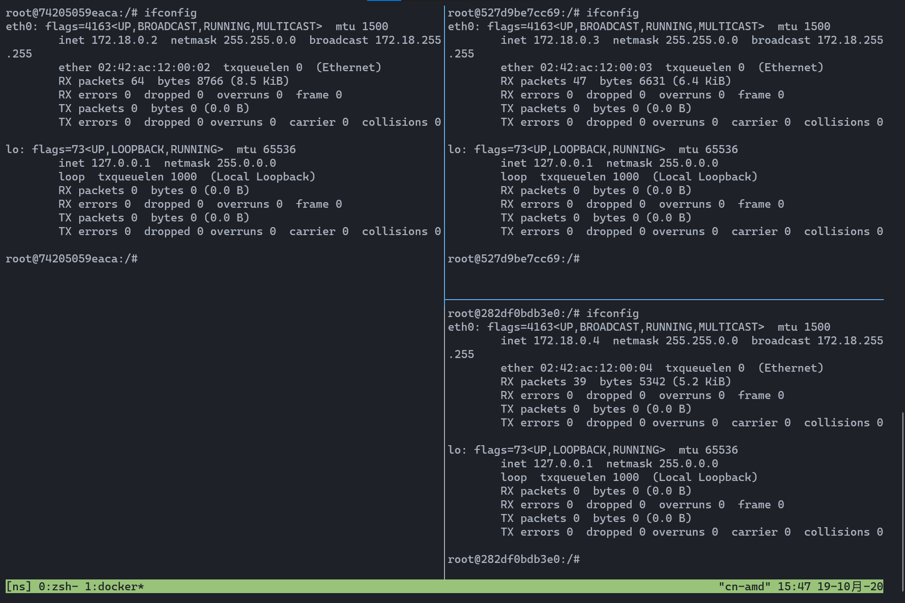
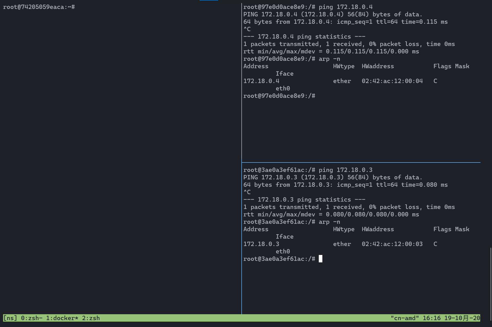
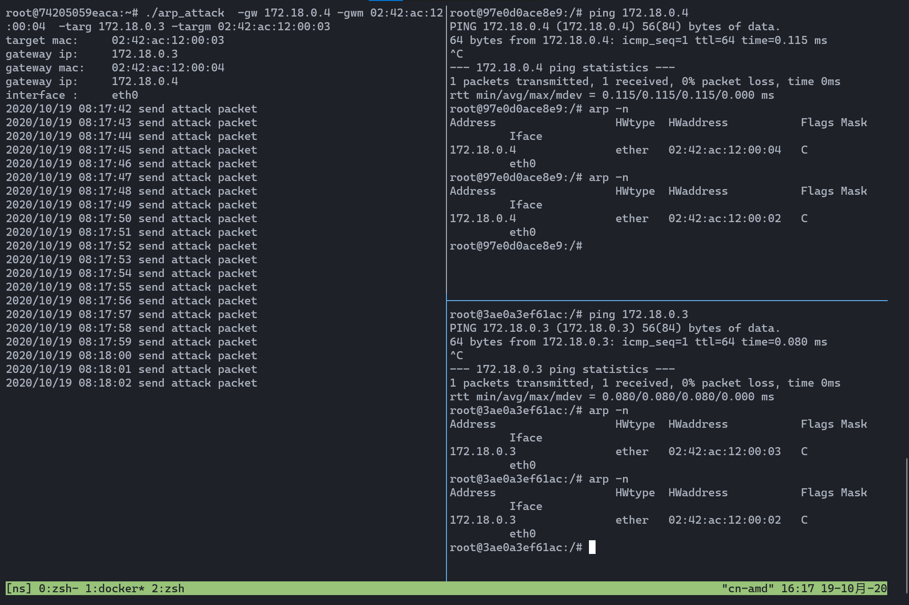
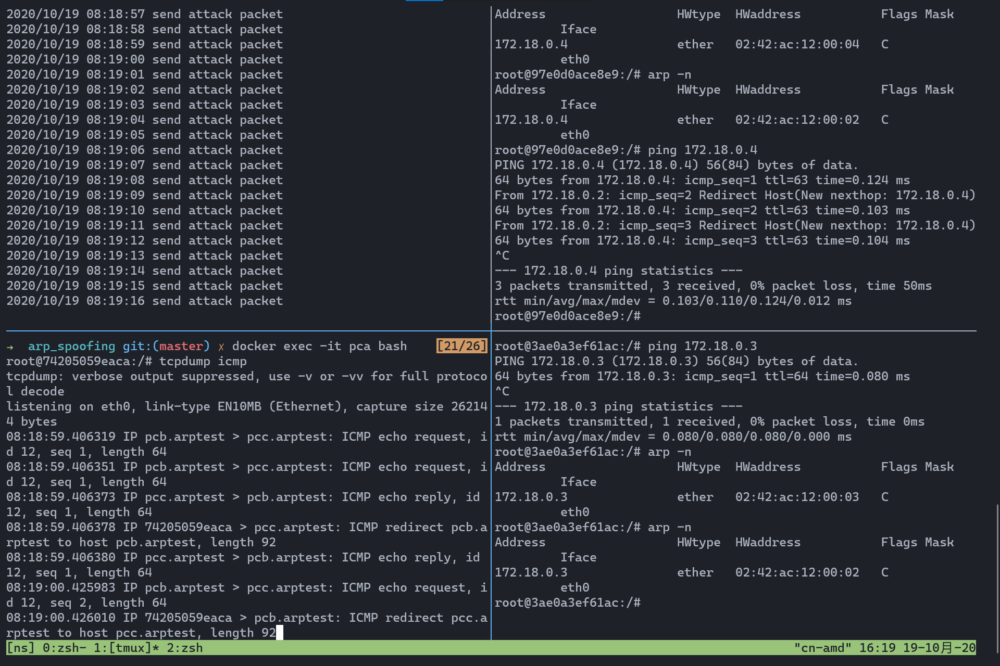

ARP攻击
=======

原理
----

ARP协议负责转换网络层的IP地址和数据链路层的MAC地址。攻击者可以伪造ARP返回伪造的ARP报文，使受害者错认为目的IP（一般是网关IP）的MAC地址是攻击者MAC地址；同理，攻击者可向网关发送伪造ARP报文，使网关认为受害者IP对应的MAC地址为攻击者MAC地址。基于此，攻击者可实现截获受害者和网关之间的报文。

实现
----

使用golang和libpcap实现构造伪造的ARP数据包，实现ARP攻击。

测试
----

在docker中对arp攻击程序进行测试。

### 测试环境

基于debian构建测试镜像，Dockerfile如下所示。

```Dockerfile
from debian:latest
RUN apt update
RUN apt install -y net-tools tcpdump
```

启动三台容器: PCA, PCB, PCC， 分别作为攻击者，受害者和受害网关。

### 测试结果

首先启动容器。攻击者，受害者，受害网关的IP和MAC地址如下图所示。



受害者和网关之间可以正常通信。查看系统arp表，由下图可见系统已经学习到了正确的arp记录。



在PCA上启动arp攻击，再次查看PCB和PCC的ARP表，由下图可见ARP表已经被污染。



在PCB上`ping` PCC，在PCA上打开tcpdump截取ICMP协议报文。由下图可见PCB和PCC间的通信报文已被PCA截获。


